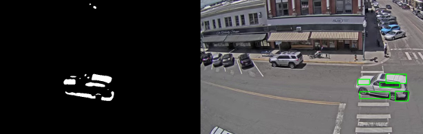
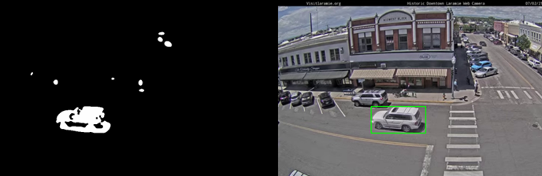
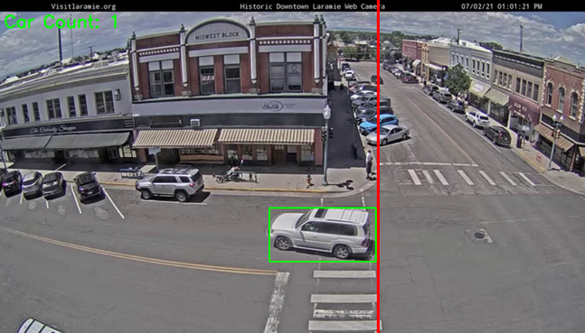
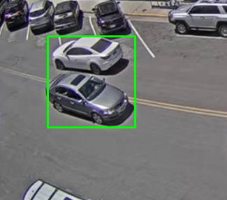

# Intelligent Signal Processing – Vehicle Detection & Counting
## Overview
This project builds a computer vision system in Python and OpenCV to detect, track, and count vehicles in real-world traffic footage using classical image processing. It emphasizes robust motion detection under challenges like noise, lighting changes, and object overlap.

## Key Features
- Motion-based vehicle detection using frame differencing and background subtraction
- Noise reduction using Gaussian blurring and morphological operations
- Contour-based object detection with size filtering
- Centroid-based multi-object tracking
- Rule-based vehicle counting using a virtual line-crossing method
- Real-time visualization of detection, tracking, and counting results

## Technical Approach
### 1. Vehicle Detection
  - Video frames are read sequentially and converted to grayscale
  - Gaussian blur is applied to reduce noise
  - Motion is detected using frame differencing
  - Binary thresholding highlights significant movement
  - Contours are extracted using cv2.findContours
  - Small contours are filtered out to ignore irrelevant motion (e.g. pedestrians)

**Challenge:**  
Vehicles with similar color to the road (e.g. white or grey cars) produced fragmented contours.  

**Solution:**  
Applied morphological closing (dilation followed by erosion) with a 20×20 kernel to fill gaps and produce more stable bounding boxes.  

### 2. Vehicle Tracking
- Each detected vehicle is represented by the centroid of its bounding box
- Centroids are tracked across frames using Euclidean distance matching
- If a detected centroid is within a threshold distance (20 pixels) of a previous centroid, it is considered the same vehicle
- Vehicle positions are stored and updated in a dictionary to maintain identity over time

### 3. Vehicle Counting

- A virtual vertical counting line is placed in the frame
- A vehicle is counted when:
- Its centroid crosses the line from right to left
- It has not been counted before
- A buffer is used to prevent double-counting of the same vehicle

### Results

| Video File              | Total Vehicles | Vehicles per Minute |
|-------------------------|----------------|---------------------|
| Traffic_Laramie_1.mp4   | 6              | 2.02                |
| Traffic_Laramie_2.mp4   | 4              | 2.27                |

### Limitations & Observations
- Bounding boxes may merge when vehicles are very close together
  
  
- The system uses classical vision techniques and does not incorporate deep learning
- Performance may vary under extreme lighting or heavy occlusion
- These limitations highlight areas for future improvement, such as deep learning-based detection or more advanced multi-object tracking algorithms.

### Technologies Used
- Python
- OpenCV
- NumPy
- Classical image processing techniques

### Possible Improvements
- Replace contour-based detection with CNN-based object detection
- Improve tracking robustness with Kalman filters or SORT/DeepSORT
- Support multiple counting directions and lanes
- Optimize performance for real-time deployment
